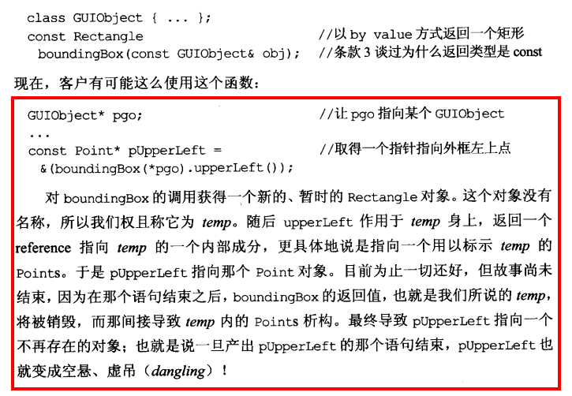
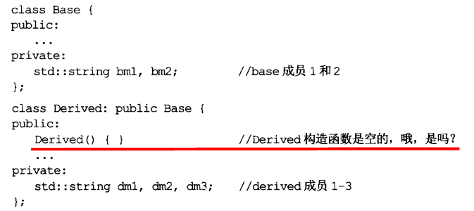
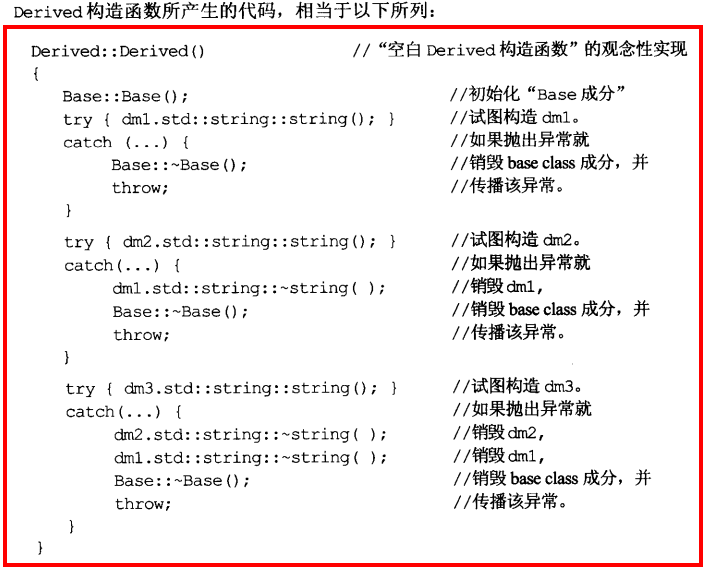

# 条款27	尽量少做转型动作

C风格转型

- （T）expression

- 函数风格转型

  T（expression）

C++提供4种转型

- const_cast\<T>(experssion)

  通常用来将对象的常量性（const）移除

- dynamic_cast\<T>(experssion)

  主要来执行“安全向下转型”

  通常是在derived class对象上执行derived class操作函数，但是你只有指向base的指针或引用时，并且**不是virtual函数**，你只能靠他处理

  ```cpp
  class window{...};
  class specialWindow:public window{
  public:
  	void blink();
  	...
  }
  typedef std::vector<std::tr1::shared_ptr<window>> VPW;
  VPW wv;
  //尽量不使用dynamic_cast
  for(auto it = begin(wv);it != wv.end();++it)
  	if(specialWindow *psw = dynamic_cast<specialWindow*>(it->get()))
  		psw->blink();
  //应该这样做
  typedef std::vector<std::tr1::shared_ptr<specialWindow>> VPSW;
  VPSW wv;
  for(auto it = begin(wv);it != wv.end();++it)
  	(*it)->blink();
  ```

  

- reinterpret_cast\<T>(experssion)

  对一个类型进行重定义

- static_cast\<T>(experssion)

  强迫隐式转换，但无法将const转换为non-const

```
class Widget{
public:
	explicit Widget(int size);//explicit取消了隐式转换
}
void dowork(const Widget& w);
dowork(Widget(15));//以一个int加上"函数风格"的转型动作创建一个Widget
dowork(static_cast<Widget>(15));//
```

# 条款28	避免返回handles指向对象内部成分

类似java的getter，但和条款15的资源管理类要区分开，资源管理类要对外提供接口

- 避免返回handles（引用、指针、迭代器）指向对象内部
- 可以返回const 引用，保证外界无法修改
- 可增加封装性，将dangling handles 可能性降到最低



# 条款29	为”异常安全“努力是值得的

## **异常安全两个条件：**

- ### **不泄露任何资源**

- ### **不允许数据破坏**

```cpp
class PrettyMenu{
public:
    ...
    void changeBackground(std::istream& imgSrc);
    ...
private:
    Mutex mutex;
    Image* bgImage;
    int imageChanges;
};

void PrettyMenu::changeBackground(std::istream& imgSrc){
    lock(&mutex);
    delete bgImage;
    ++imageChanges;
    bgImage = new Image(imgSrc);
    unlock(&mutex);
}
```

上述代码没有做到异常安全

1. new Image导致异常，则unlock调用不会执行，mutex就无法解锁
2. new Image导致异常，imageChange已被修改，指针也没指向正确的图像

可以通过条款14的Lock类保证mutex的释放

## **异常安全函数提供以下三个保证之一：**

1. ### **基本型：**

   **如果异常被抛出，程序内任何事物仍保持有效状态下。**

2. ### **强烈型**

   **如果异常被抛出，程序状态不改变**

   可使用**copy and swap**策略提供强烈安全性

   ```cpp
   struct PMImpl{
   	std::tr1::shared_ptr<Image>bgImage;
   	int imageChanges;
   };
   class PrettyMenu{
   public:
       ...
       void changeBackground(std::istream& imgSrc);
       ...
   private:
       Mutex mutex;
       std::tr1::shared_ptr<PMImpl> pImpl;
   };
   
   void PrettyMenu::changeBackground(std::istream& imgSrc){
       using std::swap;
       Lock ml(&mutex);
       std::tr1::shared_ptr<PMImpl> pNew(new PMImpl(*pImpl));//生成副本
       pNew->bgImage.reset(new Image(imgSrc));
       ++pNew->imageChanges;
   	swap(pImpl,pNew);//置换数据
   }
   ```

   

3. ### **不抛异常型**

   **不抛掷保证（nothrow），承诺绝不抛出异常。**

   `int dosth() throw();`

# 条款30	透彻了解inlining的里里外外

- **不要只因为function templates出现在头文件，就将其声明为inline，当你确定所有具现化出来的函数都应该inlined，再将其声明为inline**

- **定义在class内部的函数默认为inline函数**

#### inline函数背后的整体观念是，将“对此函数的每一个调用”都以函数本体替换之


如果一些函数被频繁调用，不断地有函数入栈，即**函数栈**，会造成栈空间或**栈内存**的大量消耗。

例如：

```
#include <stdio.h>  
 
//函数定义为inline即:内联函数  
inline char* dbtest(int a) 
{  
	return (i % 2 > 0) ? "奇" : "偶";  
}   
  
int main()  
{  
	int i = 0;  
	for (i=1; i < 100; i++) 
	{  
		printf("i:%d    奇偶性:%s /n", i, dbtest(i));      
	}  
} 
```

**上面的例子就是标准的内联函数的用法，使用inline修饰带来的好处我们表面看不出来，其实在内部的工作就是在每个for循环的内部任何调用dbtest(i)的地方都换成了(i%2>0)?"奇":"偶"这样就避免了频繁调用函数对栈内存重复开辟所带来的消耗。**


**inline函数通常位于头文件中**，因为大多数配置环境在编译过程中进行inlining，而为了将一个“函数调用”替换为“被调用函数的本体”，编译器必须直到哪个函数是什么样子

**使用函数指针调用inline函数可能不会被inlined**

构造、析构往往不适合作为inline函数



