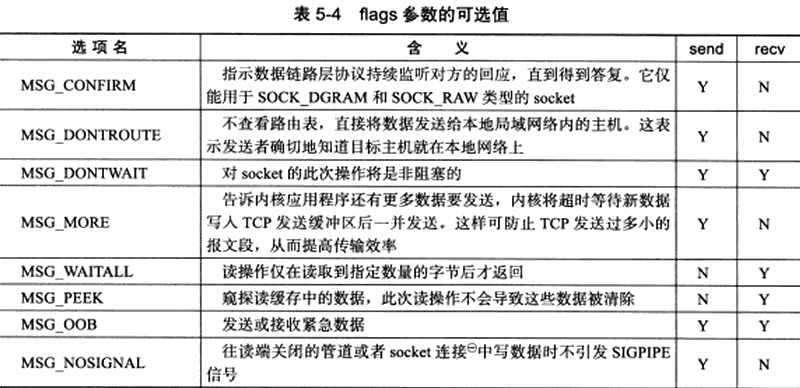
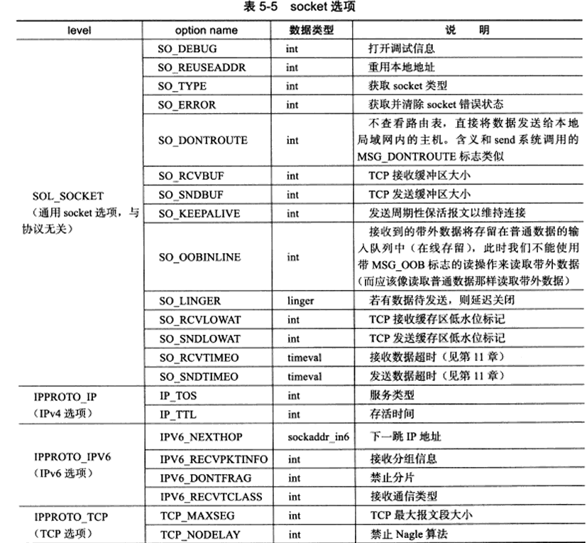
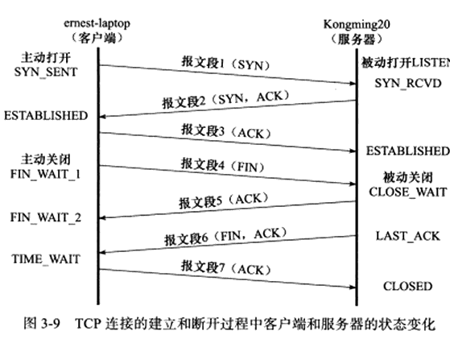
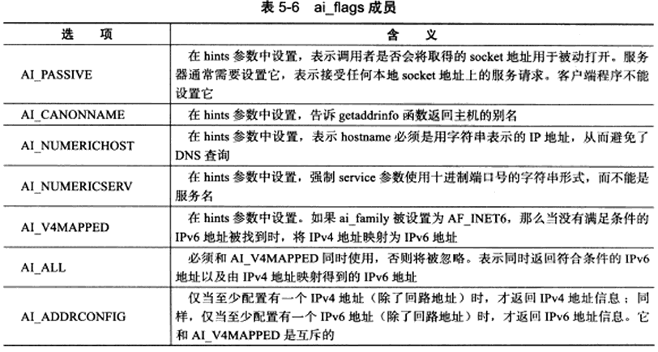
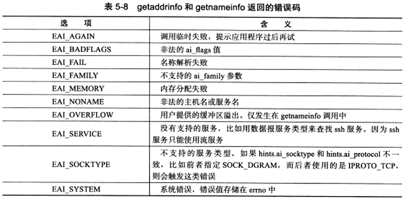

## 1	创建socket

```c
#incldue <sys/types.h>
#include <sys/socket.h>
//成功返回一个socket文件描述符，失败-1设置errno
int socket(int domain,int type,int protocol);
//domain 底层协议族	PF_INET or PF_INET6
//type 	服务类型	SOCK_STREAM	SOCK_UGRAM
//protocol	几乎所有情况下，都应为0
```

## 2	命名socket

```c
#incldue <sys/types.h>
#include <sys/socket.h>
//成功0	失败-1设置errno
int bind(int sockfd,const struct sockaddr* my_addr,socklen_t addrlen);
//绑定服务器sockaddr
```

## 3	监听socket

```c
#include <sys/socket.h>
int listen(int sockfd,int backlog);
//sockfd指定被监听的socket
//backlog提示内核监听队列的最大长度
```

## 4	接收连接

```c
#incldue <sys/types.h>
#include <sys/socket.h>

int accept(int sockfd,struct sockaddr* addr,socklen_t* addrlen);
```

## 5	发起连接

```c
#incldue <sys/types.h>
#include <sys/socket.h>
//客户端主动连接服务器
int connect(int sockfd,const struct sockaddr* serv_addr,socklen_t addrlen);
```

## 6	关闭连接

```c
#include <unistd.h>
//将fd引用计数-1，fd引用计数为0才关闭连接
int close(int fd);

//如果无论如何要立刻终止连接
#include <sys/socket.h>
int shutdown(int sockfd,int howto);
```


## 7	数据读写（recv recvfrom send sendto）

### 7.1	TCP数据读写

```c
#incldue <sys/types.h>
#include <sys/socket.h>
//返回实际读取数据的长度
ssize_t recv(int sockfd,void* buf,size_t len,int flags);

ssize_t send(int sockfd,const void* buf,size_t len,int flags);
```



#### 7.1.1	服务器读取带外数据

```cpp
#include <sys/socket.h>
#include <netinet/in.h>
#include <arpa/inet.h>
#include <assert.h>
#include <stdio.h>
#include <unistd.h>
#include <stdlib.h>
#include <errno.h>
#include <string.h>
#include <signal.h>
#include <fcntl.h>
#define BUFSIZE 1024
int main(int argc,char *argv[]){
    if(argc <=2){
        printf("usage: %s ip port\n",basename(argv[0]));
        return 1;
    }
    const char* ip=argv[1];
    int port=atoi(argv[2]);

    struct sockaddr_in addr;
    bzero(&addr,sizeof(addr));
    addr.sin_family=AF_INET;
    inet_pton(AF_INET,ip,&addr.sin_addr);
    addr.sin_port=htons(port);

    int sock=socket(PF_INET,SOCK_STREAM,0);
    assert(sock>=0);

    int ret = bind(sock,(struct sockaddr*)&addr,sizeof(addr));
    assert(ret!=-1);
    
    ret = listen(sock,5);
    assert(ret!=-1);
    struct sockaddr_in client;
    socklen_t clientlen=sizeof(client);
    int connfd=accept(sock,(struct sockaddr*)&client,&clientlen);
    if(connfd<0){
        printf("errno is %d\n",errno);
    }else{
        char buffer[BUFSIZE];
        memset(buffer,'\0',BUFSIZE);
        ret = recv(connfd,buffer,BUFSIZE-1,0);
        printf("got %d bytes of normal data '%s'\n",ret,buffer);
    
        memset(buffer,'\0',BUFSIZE);
        ret = recv(connfd,buffer,BUFSIZE-1,MSG_OOB);
        printf("got %d bytes of oob data '%s'\n",ret,buffer);
        
        memset(buffer,'\0',BUFSIZE);
        ret = recv(connfd,buffer,BUFSIZE-1,0); 
        printf("got %d bytes of normal data '%s'\n",ret,buffer);
        close(connfd);

    }
    close(sock);
    return 0;

}
```

#### 7.1.2	客户端发送带外数据

```cpp
#include <sys/socket.h>
#include <netinet/in.h>
#include <arpa/inet.h>
#include <assert.h>
#include <stdio.h>
#include <unistd.h>
#include <stdlib.h>
#include <errno.h>
#include <string.h>
#include <signal.h>
#include <fcntl.h>

int main(int argc,char *argv[]){
    if(argc <=2){
        printf("usage: %s ip port\n",basename(argv[0]));
        return 1;
    }
    const char* ip=argv[1];//服务器ip
    int port=atoi(argv[2]);//服务器端口号

    struct sockaddr_in serveraddr;
    bzero(&serveraddr,sizeof(serveraddr));
    serveraddr.sin_family=AF_INET;
    inet_pton(AF_INET,ip,&serveraddr.sin_addr);
    serveraddr.sin_port=htons(port);

    int sock=socket(PF_INET,SOCK_STREAM,0);
    assert(sock>=0);
    if(connect(sock,(struct sockaddr*)&serveraddr,sizeof(serveraddr))<0){
        printf("connection failed\n");

    }
    else{
        const char* oob_data="abcwhat a oob data!";
        const char* normal_data="123";
        send(sock,normal_data,strlen(normal_data),0);
        sleep(3);
        send(sock,oob_data,strlen(oob_data),MSG_OOB);
        sleep(3);
        send(sock,normal_data,strlen(normal_data),0);
    }
    close(sock);
    return 0;
}
```

### 7.2	UDP数据读写

```c
#include <sys/types.h>
#include <sys/socket.h>

ssize_t recvfrom(int sockfd,void* buf,size_t len,int flags,struct sockaddr* src_addr,socklen_t* addrlen);
ssize_t sendto(int sockfd,void* buf,size_t len,int flags,struct sockaddr* dest_addr,socklen_t* addrlen);
//buf len为缓冲区位置和大小
//src_addr 发送端socket地址
//addrlen 地址长度
```


## 8 	通用数据读写（recvmsg和sendmsg）

```c
#include <sys/socket.h>

ssize_t recvmsg(int sockfd,struct msghdr* msg,int flags);

ssize_t sendmsg(int sockfd,struct msghdr* msg,int flags);

struct msghdr{
	void* msg_name;				//socket地址
	socklen_t mas_namelen;		//socket地址长度
	struct iovec* msg_iov;		//分散的内存块
	int msg_iovlen;				//分散内存块数量
	void* msg_control;			//指向辅助数据的起始位置
	socklen_t msg_controllen;	//辅助数据大小
	int msg_flags;				//复制函数中的flags参数，并在调用过程中更新
};
struct iovec{
    void* iov_base;				//内存起始位置
    size_t iov_len;				//内存长度
};
```


## 9	带外标记

```c
#include <sys/socket.h>
//判断sockfd是否处于带外标记，即下一个被读取到的数据是否是带外数据，是1否0
//是则可以利用MSG_OOB标志的recv接收带外数据
int sockatmark(int sockfd);
```


## 10	地址信息函数

```c
#include <sys/socket.h>
//获得一个连接socket的本端地址
int getsockname(int sockfd,struct sockaddr* addr,socklen_t* addr_len);
//获得一个连接socket的远端地址
int getpeername(int sockfd,struct sockaddr* addr,socklen_t* addr_len);
```


## 11	socket选项

```c
#include <sys/socket.h>
//用来读取、设置socket文件描述符属性的方法

//成功0 失败-1设置errno
int getsockopt(int sockfd,int level,int option_name,void* option_value,socklen_t* restrict option_len);

int setsockopt(int sockfd,int level,int option_name,const void* option_value,socklen_t option_len);
```



**对于服务器，有部分socket选项只能在调用listen前针对监听socket设置才有效，这是因为连接socket只能由accept调用返回，而accept从listen监听队列中接受的连接至少已经完成了TCP三次握手的前两个步骤（因为listen监听队列中的连接至少已经进入SYN_RCVD状态），这说明服务器已经往被接受连接上发送出了TCP同步报文段。但有的socket选项却应该在TCP同步报文段中设置，比如TCP最大报文段选项。**

**linux给开发人员提供的方案是：对监听socket设置的这些socket选项，那么accept返回的连接socket会自动继承这些选项**

**选项包括：SO_DEBUG	SO_DONTROUTE	SO_KEEPALIVE	SO_LINGER	SO_OOBINLINE	SO_RCVBUF	SO_RCVLOWAT	SO_SNDBUF	SO_SNDLOWAT	TCP_MAXSEG	TCP_NODELAY**

**对客户端而言，这些socket选项则应该在调用connect函数前设置，因为connect调用成功后，TCP三次握手已完成**

### 11.1	SO_REUSEADDR选项

- #### **TIME_WAIT状态**

  

  客户端连接收到服务器的结束报文段（报文段6）后，并未直接进入CLOSED状态，而是转移到TIME_WAIT状态。这个状态下，客户端要等待长为2MSL(Maximum Segment Life，报文段最大生存时间)的时间，才能完全关闭

  ##### 存在理由：

  1. **可靠地终止TCP连接**
  2. **保证迟来的TCP报文段有足够时间被识别并丢弃**

- ### 通过设置socket选项SO_REUSEADDR可强制使用被处于TIME_WAIT状态的连接占用的socket地址

  ```c
  int sockfd = socket(PF_INET,SOCK_STREAM,0);
  assert(sock >= 0);
  int reuse = 1;
  setsockopt(sock,SOL_SOCKET,SO_REUSEADDR,&reuse,sizeof(reuse));
  
  struct sockaddr_in addr;
  bzero(&addr,sizeof(addr));
  addr.sin_family = AF_INET;
  inet_pton(AF_INET,ip,&addr.sin_addr);
  address.sin_port = htons(port);
  int ret = bind(sock,(struct sockaddr*)&addr,sizeof(addr));
  ```

  也可修改内核参数`/proc/sys/net/ipv4/tcp_tw_recycle`来快速回收被关闭的socket，使得TCP连接根本不进入TIME_WAIT状态

### 11.2	SO_RCVBUF和SO_SNDBUF选项

- #### 使用setsockopt设置接收和发送缓冲区的大小

```c
int sendbuf = 2048;
setsockopt(sock,SOL_SOCKET,SO_SNDBUF,&sendbuf,sizeof(sendbuf));

int recvbuf = 2048;
setsockopt(sock,SOL_SOCKET,SO_RCVBUF,&sendbuf,sizeof(sendbuf));
```

### 11.3	SO_RCVLOWAT和SO_SNDLOWAT选项

- #### TCP接收缓冲区和发送缓冲区的低水位标记

- #### 一般被I/O复用系统调用来判断socket是否可读或可写，当TCP接收缓冲区中可读时间总数大于低水位标记，I/O复用系统才会通知程序可以从对应的socket读取数据，同理发送缓冲区可写入数据空间大于低水位标记，I/O复用系统才会通知程序可以往对应socket上写数据

- #### 默认均为1字节

### 11.4	SO_LINGER选项

- 用于控制close系统调用在关闭TCP连接时的行为
- 默认情况下，close关闭一个socket，close立即返回，TCP模块负责把该socket对应TCP发送缓冲区中残留数据发送给对方

- 使用时需要传递一个linger结构体

  ```c
  #include <sys/socket.h>
  struct linger{
  	int l_onoff;	//开启（not 0）关闭（0）
  	int l_linger;	//滞留时间
  };
  ```

  #### 根据linger成员变量不同，有三种情况：

  - `l_onoff==0` SO_LINGER选项不起作用，close用默认行为
  - `l_onoff!=0 l_linger==0`c;pse系统调用立即返回，TCP模块将丢弃被关闭的socket对应的TCP发送缓冲区中的残留数据，同时给对方发送一个复位报文段，这种情况给服务器提供了异常终止一个连接的方法
  - `l_onoff!=0 l_linger>0`close此时行为取决于两个条件：
    - 被关闭的socket对应的TCP发送缓冲区是否还有残留数据
    - 该socket是阻塞还是非阻塞
      - 阻塞 ：close将等待一段长为l_linger的时间，直到TCP模块发送完所有残留数据并得到对方的确认，如果这段时间内TCP模块没有发送完残留数据并得到对方确认，close返回-1并设置errno为EWOULDBLOCK
      - 非阻塞：close立即返回，此时需要根据返回值和errno判断残留数据是否发送完毕


## 12	网络信息API

### 12.1	gethostbyname和gethostbyaddr

- #### 二者不可重入，非线程安全

```c
#include <netdb.h>
struct hostent* gethostbyname(const char* name);
struct hostent* gethostbyaddr(const void* addr,size_t len,int type);

struct hostent{
    char* h_name;				//主机名
    char** h_aliases;			//主机别名列表
    int h_addrtype;				//地址类型（地址族）
    int h_length;				//地址长度
    char** h_addr_list;			//网络字节序列出的主机IP地址列表
};
```

### 12.2	getservbyname和getservbyport

- #### 二者不可重入，非线程安全

```c
#include <netdb.h>
//name 目标服务的名字   proto围殴服务类型  tcp流服务 udp数据包服务
struct servent* getservbyname(const char* name,const char* proto);
struct servent* getservbyport(int port,const char* proto);
struct servent{
    char* s_name;				//服务名称
    char** s_aliases;			//服务别名列表
    int s_port;					//端口号
    char* s_proto;				//服务类型 通常是tcp或udp
};
```


### 12.3	getaddrinfo

- ##### 函数是否可重入取决于内部调用gethostbyname和getservbyname函数

```c
#include <netdb.h>

//既能通过主机名获得IP地址(内部使用gethostbyname) 	也能通过服务名获得端口号(内部使用getservbyname)

//hostname可接受主机名也可以是IP地址
//service可接收服务名也可接收端口号
//hints可以为NULL，表示允许getaddrinfo反馈任何可用的结果
//result指向一条链表，用于存储getaddrinfo反馈的结果
int getaddrinfo(const char* hostname,const char* service,const struct addrinfo* hints,struct addrinfo** result);

struct addrinfo{
    int ai_flags;					//如下图
    int ai_family;					//地址族
    int ai_socktype;				//服务类型 SOCK_STREAM SOCK_DGRAM
    int ai_protocol;				//如下
    socklen_t ai_addrlen;			//socket地址ai_addr长度
    char* ai_canonname;				//主机别名
    struct sockaddr* ai_addr;		//指向socket地址
    struct addrinfo* ai_next;		//指向下一个sockinfo结构的对象
};
```



当使用hints参数时，可以设置：ai_flags	ai_family	ai_socktype	ai_protocol四个字段，其他字段必须设置为NULL


#### 注意：getaddrinfo隐式分配内存给res指针，res指针原本是没有指向一块合法内存，因此使用完后要释放内存

```c
#include <netdb.h>
void freeaddrinfo(struct addrinfo* res);
```

### 12.4	getnameinfo

- ##### 函数是否可重入取决于内部调用gethostbyaddr和getservbyport函数

```c
#include <netdb.h>
//通过socket地址同时获得字符串表示的主机名(内部使用gethostbyaddr)和服务名(内部使用getservbyport)
//主机名存储在host参数
//服务名存储在serv参数
//flags控制getnameinfo行为
//成功0 失败返回错误码如下
int getnameinfo（const struct sockaddr* sockaddr,socklen_t addrlen,char* host,socklen_t hostlen,char* serv,socklen_t servlen,int flags);
```


